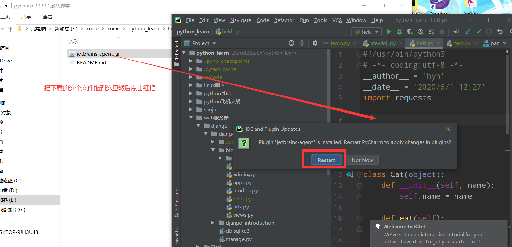
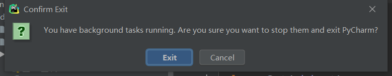
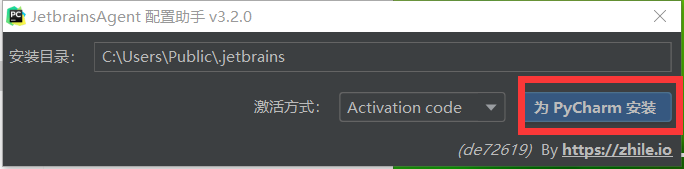
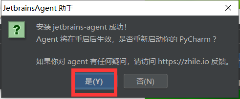
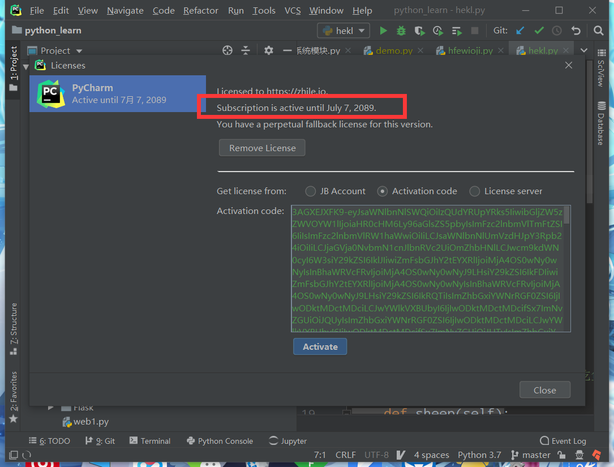

# pycharm专业版激活教程
## 下载pychrm
>windows下载地址(直接点击链接自动下载):https://download.jetbrains.8686c.com/python/pycharm-professional-2020.1.1.exe
>
>安装：直接一直下一步就好了。。
>
linux (依赖java:所以你得装好java再)下载安装:
```shell script
wget https://download.jetbrains.8686c.com/python/pycharm-community-2020.3.2.tar.gz && sudo tar -zxvf pycharm-community-2020.3.2.tar.gz -C /opt/ && /opt/pycharm-community-2020.3.2/bin/pycharm.sh
```
## 破解包下载地址:
windows使用浏览器直接点击就可以自动下载(你得有gitee（这个网站）账号)：https://gitee.com/muaimingjun/python_learn/raw/master/linux%E8%84%9A%E6%9C%AC/pycharm2020.1%E6%BF%80%E6%B4%BB%E8%84%9A%E6%9C%AC/jetbrains-agent.jar

liunx使用：
```shell script
wget https://gitee.com/muaimingjun/python_learn/raw/master/linux%E8%84%9A%E6%9C%AC/pycharm2020.1%E6%BF%80%E6%B4%BB%E8%84%9A%E6%9C%AC/jetbrains-agent.jar
```

windows和linux也是一样的。。



点击 exit



点击红框就好了




点击是



